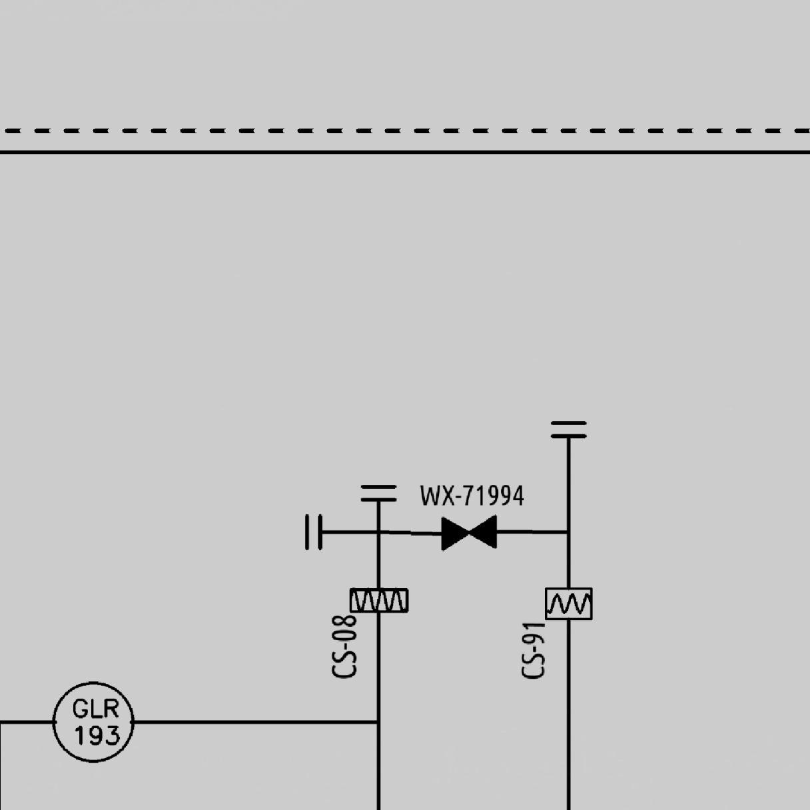
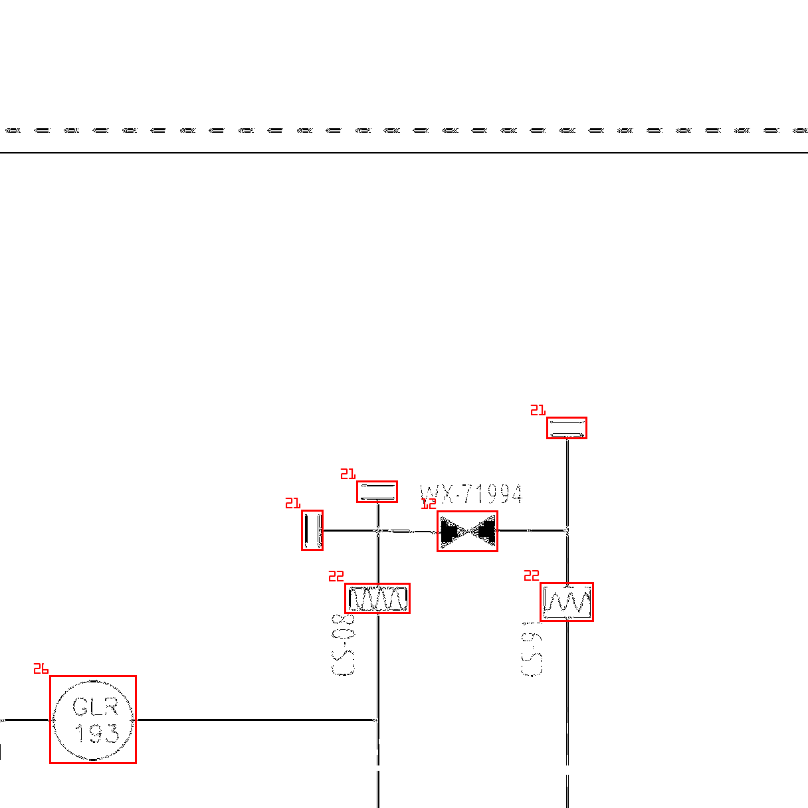
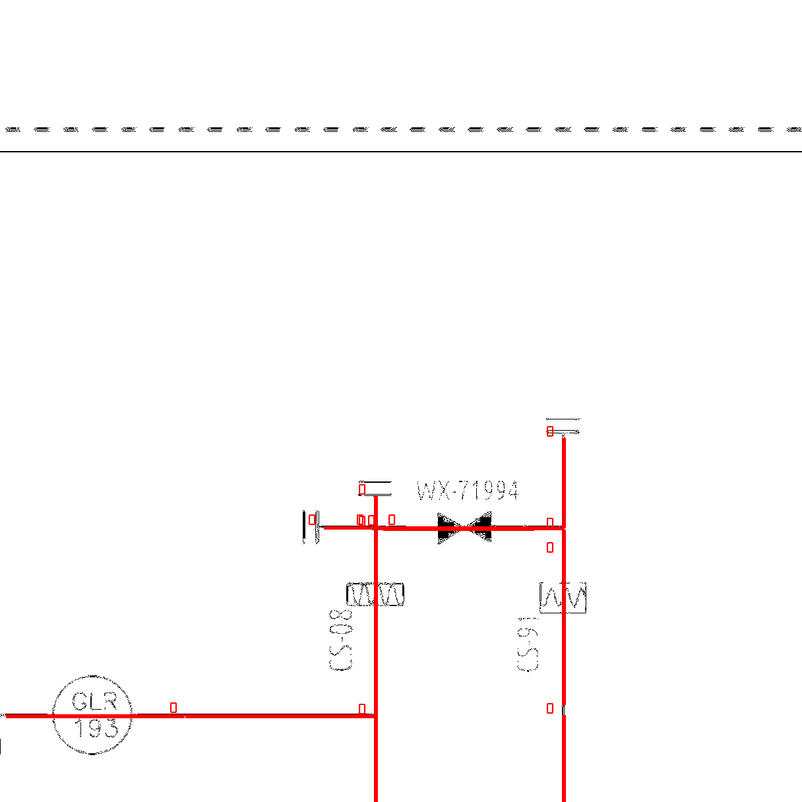

# d8n-dotnet-clients

Docs: https://documenter.getpostman.com/view/989374/2s935hS7qK

This is a library for .NET core 7. Please note that the .NET Framework version is still in development.

Nuget Package:
[](https://www.nuget.org/packages/d8n-object-detection-core/)

# How to start

```csharp
using D8nObjectDetection;

DocumentClient client = new DocumentClient("YOUR-API-KEY");
var result = await client.RunAnalysis("./test.jpg");

// Query for status once in a while (until status is equal to "Completed")
var objects = await client.GetStatus(result);

await Task.Delay(3000);
// Returns the object coordinates. See
var objects = await client.GetCompleted(result);
```
Object now contains extracted info. For the full properties of what we can extract see this:
 https://github.com/ch-hristov/d8n-dotnet-clients/blob/b11294a0fc588b00be9b20baef886e9de530faf7/d8n-dotnet-client-core/DocumentClient.cs#L7

# Extract images

If you pass 1-st image to RunAnalysis(), you can get the second and third images
<div style="display:flex; flex-direction:row;">




Here's how:
 
```csharp
var symbolImage = await client.GetSymbols(result);
symbolImage.Save("./data.png");
 
var lineImage = await client.GetLines(result);
symbolImage.Save("./line.png");
```
Note: `result` is the id variable returned from RunAnalysis()

# Limits
 1. Image size: 10MB
 2. Limits to number of requests apply.
